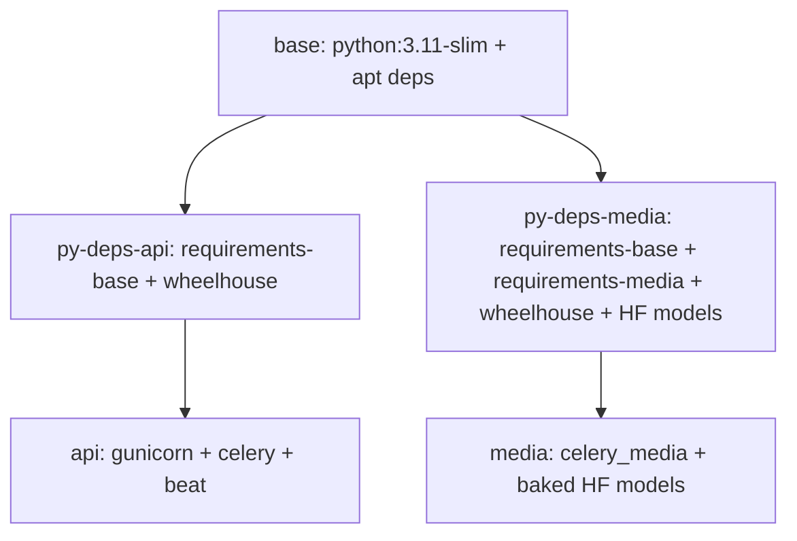

# Multi-Stage Dockerfile

## Overview

**File:** `Dockerfile` — 5 stages, 2 final images (`api`, `media`)



---

## Stage 1: `base` (Shared OS Layer)

```dockerfile
FROM python:3.11-slim-bookworm AS base

ENV PYTHONDONTWRITEBYTECODE=1 \
    PYTHONUNBUFFERED=1 \
    PIP_NO_CACHE_DIR=1 \
    PIP_DISABLE_PIP_VERSION_CHECK=1

# Non-root user
RUN groupadd -g 1000 appgroup \
 && useradd -u 1000 -g appgroup -s /bin/bash -m appuser

# Apt deps (ONCE for all stages)
RUN apt-get update \
 && apt-get install -y --no-install-recommends --fix-missing \
      libpq-dev gcc postgresql-client ffmpeg libsndfile1 \
 && rm -rf /var/lib/apt/lists/*

WORKDIR /app
```

### Installed Packages
| Package | Purpose |
|---------|---------|
| `libpq-dev` | PostgreSQL client library (psycopg2) |
| `gcc` | Compile C extensions |
| `postgresql-client` | `pg_isready` for healthcheck |
| `ffmpeg` | Audio processing (HLS, normalize) |
| `libsndfile1` | Audio file I/O (soundfile) |

---

## Stage 2: `py-deps-api` (API Dependencies)

```dockerfile
FROM base AS py-deps-api

RUN python -m venv /opt/venv
ENV PATH="/opt/venv/bin:$PATH"

COPY requirements-base.txt constraints.txt ./
COPY wheelhouse/ /wheelhouse/

RUN pip install --no-cache-dir \
      --default-timeout=120 --retries 10 \
      --no-index --find-links=/wheelhouse \
      -c constraints.txt \
      -r requirements-base.txt \
 && rm -rf /wheelhouse
```

### Key Points
- **Offline install** — `--no-index --find-links=/wheelhouse`
- **Constraints** — Version pinning via `constraints.txt`
- **No pip upgrade** — Bundled pip works, avoids PyPI round-trip
- **Output:** `/opt/venv` with API deps only

---

## Stage 3: `py-deps-media` (Media Dependencies + HF Models)

```dockerfile
FROM base AS py-deps-media

# Cache locations BEFORE baking (copied to media stage)
ENV HF_HOME=/home/appuser/.cache/huggingface \
    TORCH_HOME=/home/appuser/.cache/torch \
    SENTENCE_TRANSFORMERS_HOME=/home/appuser/.cache/huggingface

RUN python -m venv /opt/venv
ENV PATH="/opt/venv/bin:$PATH"

COPY requirements-base.txt requirements-media.txt constraints.txt ./
COPY wheelhouse/ /wheelhouse/

# Single resolver pass (CPU torch via extra-index-url in Dockerfile)
RUN pip install --no-cache-dir \
      --default-timeout=1000 --retries 10 \
      --no-index --find-links=/wheelhouse \
      -c constraints.txt \
      -r requirements-media.txt \
 && rm -rf /wheelhouse

# BAKE HUGGINGFACE MODELS (BuildKit secret for HF_TOKEN)
RUN --mount=type=secret,id=hf_token \
    set -eu; \
    if [ -s /run/secrets/hf_token ]; then \
        export HF_TOKEN="$(cat /run/secrets/hf_token)"; \
    fi; \
    python -c "from faster_whisper import WhisperModel; m = WhisperModel('base', device='cpu', compute_type='int8'); del m"; \
    python -c "from sentence_transformers import SentenceTransformer; m = SentenceTransformer('all-MiniLM-L6-v2'); del m"; \
    python -c "from keybert import KeyBERT; m = KeyBERT(); del m"
```

### Key Points
- **Extra index URL** for CPU torch (in build command)
- **BuildKit secret** for `HF_TOKEN` — never in layers
- **Model baking** — downloads + caches at build time
- **Cache env vars** set before baking (copied to final)
- **`set -eu` not `-x`** — prevents token leak in logs

---

## Stage 4: `api` (Final API Image)

```dockerfile
FROM base AS api

COPY --from=py-deps-api /opt/venv /opt/venv
ENV PATH="/opt/venv/bin:$PATH"

LABEL org.opencontainers.image.title="echoflow-api" \
      org.opencontainers.image.description="EchoFlow API server and default/feed/beat Celery workers"

# Explicit allowlist (NOT COPY .)
COPY --chown=appuser:appgroup backend/ ./backend/
COPY --chown=appuser:appgroup manage.py wait_for_db.py gunicorn.conf.py ./

# Healthcheck: HTTP /health/
HEALTHCHECK --interval=30s --timeout=5s --start-period=10s --retries=3 \
    CMD python -c "import urllib.request; urllib.request.urlopen('http://localhost:8000/health/', timeout=4)" || exit 1

USER appuser
EXPOSE 8000
```

### Copied Files (Explicit Allowlist)
```
backend/           # All app code
manage.py          # Django management
wait_for_db.py     # DB polling
gunicorn.conf.py   # Gunicorn config
```

**NOT copied:** `frontend/`, `docs/`, `wheelhouse/`, `.github/`, `Dockerfile`, etc.

### Healthcheck
- Probes `http://localhost:8000/health/` **with `X-Forwarded-Proto: https` header**
- Used by `web` service
- **Overridden** for Celery workers (uses Celery ping)

---

## Stage 5: `media` (Final Media Image)

```dockerfile
FROM base AS media

COPY --from=py-deps-media /opt/venv /opt/venv
ENV PATH="/opt/venv/bin:$PATH" \
    HF_HOME=/home/appuser/.cache/huggingface \
    TORCH_HOME=/home/appuser/.cache/torch \
    SENTENCE_TRANSFORMERS_HOME=/home/appuser/.cache/huggingface

LABEL org.opencontainers.image.title="echoflow-media" \
      org.opencontainers.image.description="EchoFlow heavy_media Celery worker (FFmpeg + baked HuggingFace models)"

# Baked models from builder
COPY --from=py-deps-media --chown=appuser:appgroup \
     /home/appuser/.cache/huggingface /home/appuser/.cache/huggingface

# Same explicit allowlist
COPY --chown=appuser:appgroup backend/ ./backend/
COPY --chown=appuser:appgroup manage.py wait_for_db.py gunicorn.conf.py ./

# Healthcheck: Celery inspect ping
HEALTHCHECK --interval=30s --timeout=15s --start-period=30s --retries=3 \
    CMD celery -A backend.EchoFlow inspect ping -d "celery@$(hostname)" --timeout=10 || exit 1

USER appuser
```

### Key Differences from `api`
| Aspect | `api` | `media` |
|--------|-------|---------|
| Healthcheck | HTTP `/health/` | Celery ping |
| Models | Not baked | **Baked HF models** |
| FFmpeg | From base | From base |
| Use case | Web, default worker, feed, beat | Heavy media worker |

### Offline Runtime
```dockerfile
ENV HF_HUB_OFFLINE=1
ENV TRANSFORMERS_OFFLINE=1
```
- No network calls at runtime
- Models loaded from baked cache

---

## Build Commands

### Docker Compose (All — 12 services: db, pgbouncer, redis_broker, redis_cache, minio, minio-init, nginx, web, celery, celery_feed, celery_media, celery_beat)
```bash
docker compose build
```

### Manual Build
```bash
# API image
docker build --target api -t echoflow-api .

# Media image (requires HF_TOKEN secret)
export HF_TOKEN=hf_xxx
docker build --target media -t echoflow-media . --secret id=hf_token,env=HF_TOKEN

# Or from file
docker build --target media -t echoflow-media . --secret id=hf_token,src=./hf_token.txt
```

### Build Args
```bash
# Override tag
docker compose build --build-arg TAG=dev
```

---

## Wheelhouse (Offline Installs)

### Structure
```
wheelhouse/
├── Django-5.2.17-py3-none-any.whl
├── torch-2.8.0+cpu-cp311-cp311-linux_x86_64.whl
├── sentence_transformers-6.0.0-py3-none-any.whl
└── ... (all deps)
```

### Regeneration (Run in Python 3.11 container)
```bash
mkdir -p wheelhouse-new
docker run --rm \
  -v "$PWD/requirements-base.txt:/req/requirements-base.txt:ro" \
  -v "$PWD/requirements-media.txt:/req/requirements-media.txt:ro" \
  -v "$PWD/constraints.txt:/req/constraints.txt:ro" \
  -v "$PWD/wheelhouse-new:/out" \
  python:3.11-slim-bookworm sh -c "\
    pip wheel --no-deps -w /out 'dj-rest-auth==7.2.0' && \
    pip download --prefer-binary --retries 10 --timeout 120 \
      --extra-index-url https://download.pytorch.org/whl/cpu \
      -c /req/constraints.txt -r /req/requirements-base.txt -d /out && \
    pip download --prefer-binary --retries 10 --timeout 120 \
      --extra-index-url https://download.pytorch.org/whl/cpu \
      -c /req/constraints.txt -r /req/requirements-media.txt -d /out"

rm -rf wheelhouse && mv wheelhouse-new wheelhouse
```

### Version Constraints
| Package | Constraint | Reason |
|---------|------------|--------|
| `django` | `==5.2.17` | 6.x needs Python 3.12+ |
| `librosa` | `==0.11.0` | 1.x needs Python 3.12+ |
| `torch` | `==2.8.0` | CPU build via extra-index-url |

---

## Security: HF_TOKEN as BuildKit Secret

### Why Not `--build-arg`?
```dockerfile
# BAD - leaks in layer history
ARG HF_TOKEN
ENV HF_TOKEN=$HF_TOKEN
# `docker history` shows the token!
```

### Correct: BuildKit Secret Mount
```dockerfile
# Dockerfile
RUN --mount=type=secret,id=hf_token \
    set -eu; \
    if [ -s /run/secrets/hf_token ]; then \
        export HF_TOKEN="$(cat /run/secrets/hf_token)"; \
    fi; \
    python -c "..."

# docker-compose.yml
secrets:
  hf_token:
    environment: HF_TOKEN

# Build command
docker build --target media . --secret id=hf_token,env=HF_TOKEN
```

**Secret never in:**
- Image layers
- Build cache
- `docker history` output
- `docker inspect`

---

## Pop!_OS / Docker Compose V2 Note

```bash
# Use docker compose (V2 plugin), NOT docker-compose (V1)
docker compose build
docker compose up

# If docker-compose installed from old PPA:
sudo apt remove docker-compose
# Then use: docker compose
```

---

*Source: `Dockerfile`, `docker-compose.yml`, `AGENTS.md`*