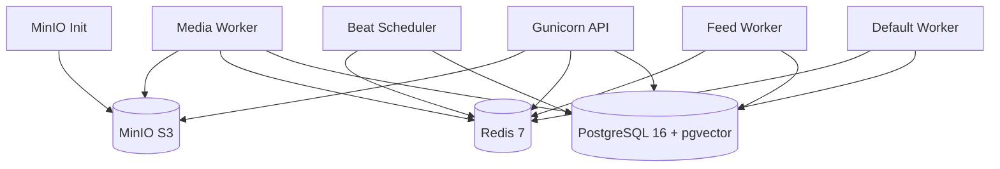

# Docker Compose Services

## Overview

**File:** `docker-compose.yml` — 7 services for full stack



---

## Service Details

### 1. `db` — PostgreSQL 16 + pgvector
```yaml
image: pgvector/pgvector:pg16
environment:
  POSTGRES_DB: ${DB_NAME}
  POSTGRES_USER: ${DB_USER}
  POSTGRES_PASSWORD: ${DB_PASSWORD}
volumes:
  - postgres_data:/var/lib/postgresql/data
ports: ["5432:5432"]
healthcheck:
  test: ["CMD-SHELL", "pg_isready -U ${DB_USER} -d ${DB_NAME}"]
deploy:
  resources:
    limits: {cpus: '2', memory: 2G, pids: 500}
```

### 2. `redis` — Redis 7
```yaml
image: redis:7-alpine
command: redis-server --appendonly yes --maxmemory 512mb --maxmemory-policy allkeys-lru
volumes:
  - redis_data:/data
ports: ["6379:6379"]
healthcheck:
  test: ["CMD", "redis-cli", "ping"]
deploy:
  resources:
    limits: {cpus: '1', memory: 1G, pids: 300}
```

**Key:** Single instance for broker + cache + feeds (audit: should split)

### 3. `minio` — S3-Compatible Storage
```yaml
image: minio/minio:RELEASE.2025-09-07T16-13-09Z
command: server /data --console-address ":9001"
environment:
  MINIO_ROOT_USER: ${AWS_ACCESS_KEY_ID:-echoflow-dev}
  MINIO_ROOT_PASSWORD: ${AWS_SECRET_ACCESS_KEY:-echoflow-dev-secret}
  MINIO_CORS_ALLOW_ORIGIN: "*"
  MINIO_CORS_ALLOW_METHODS: "GET,PUT,POST,DELETE,OPTIONS"
  MINIO_CORS_ALLOW_HEADERS: "Origin,Accept,Content-Type,Authorization,Range"
  MINIO_CORS_EXPOSE_HEADERS: "Date,Content-Length,Content-Range,Accept-Ranges"
  MINIO_CORS_MAX_AGE: "3600"
volumes:
  - minio_data:/data
ports: ["9000:9000", "9001:9001"]
healthcheck:
  test: ["CMD", "mc", "ready", "local"]
```

### 4. `minio-init` — Bucket Setup (One-shot)
```yaml
image: minio/mc:RELEASE.2025-08-13T08-35-41Z
depends_on:
  minio: {condition: service_healthy}
entrypoint: >
  sh -c "
    mc alias set local http://minio:9000 ${AWS_ACCESS_KEY_ID} ${AWS_SECRET_ACCESS_KEY} &&
    mc mb --ignore-existing local/${AWS_STORAGE_BUCKET_NAME:-echoflow-media} &&
    mc anonymous set download local/${AWS_STORAGE_BUCKET_NAME:-echoflow-media}/hls
  "
condition: service_completed_successfully
```
**Critical:** Makes `hls/` prefix public-read for HLS playback.

### 5. `web` — Gunicorn API Server
```yaml
image: devansh1012007/echoflow-api:${TAG:-latest}
build: {context: ., dockerfile: Dockerfile, target: api}
command: >
  sh -c "set -e && python wait_for_db.py &&
         python manage.py migrate &&
         python manage.py collectstatic --noinput &&
         gunicorn -c gunicorn.conf.py backend.EchoFlow.wsgi:application"
volumes: [".:/app"]  # Dev only
ports: ["8005:8000"]
depends_on:
  db: {condition: service_healthy}
  redis: {condition: service_healthy}
  minio-init: {condition: service_completed_successfully}
healthcheck:
  test: ["CMD", "python", "-c", "import urllib.request; urllib.request.urlopen('http://localhost:8000/health/')"]
deploy:
  resources:
    limits: {cpus: '2', memory: 1G, pids: 500}
```

**Startup Sequence:**
1. `wait_for_db.py` — Polls PostgreSQL (120 attempts, exponential backoff)
2. `migrate` — Runs migrations
3. `collectstatic` — WhiteNoise static files
4. `gunicorn` — 4 workers × 4 threads (configurable)

### 6. `celery` — Default Worker
```yaml
image: devansh1012007/echoflow-api:${TAG:-latest}
build: {target: api}
command: >
  sh -c "set -e && python wait_for_db.py &&
         celery -A backend.EchoFlow worker --loglevel=info"
healthcheck:
  test: ["CMD-SHELL", "celery -A backend.EchoFlow inspect ping -d \"celery@$(hostname)\" --timeout=10 || exit 1"]
```
**Queue:** `celery` (default) — Scraping, general tasks

### 7. `celery_feed` — Feed Refill Worker
```yaml
image: devansh1012007/echoflow-api:${TAG:-latest}
build: {target: api}
command: >
  sh -c "set -e && python wait_for_db.py &&
         celery -A backend.EchoFlow worker -Q fast_feed --concurrency=4 --loglevel=info"
```
**Queue:** `fast_feed` — `refill_user_feed` only, 4 threads

### 8. `celery_media` — Heavy Media Worker
```yaml
image: devansh1012007/echoflow-media:${TAG:-latest}
build:
  target: media
  secrets: [hf_token]  # BuildKit secret
command: >
  sh -c "set -e && python wait_for_db.py &&
         celery -A backend.EchoFlow worker -Q heavy_media --pool=solo --loglevel=info"
environment:
  HF_HOME: /home/appuser/.cache/huggingface
  HF_HUB_OFFLINE: "1"
  TRANSFORMERS_OFFLINE: "1"
deploy:
  resources:
    limits: {cpus: '4', memory: 1G, pids: 200}
```
**Queue:** `heavy_media` — `process_audio_to_hls` only, **solo pool** (no forking)

### 9. `celery_beat` — Scheduler
```yaml
build: {target: api}
command: >
  sh -c "set -e && python wait_for_db.py &&
         celery -A backend.EchoFlow beat --loglevel=info --scheduler django_celery_beat.schedulers:DatabaseScheduler"
healthcheck:
  disable: true  # Image's HTTP probe would fail
```
**Scheduler:** `django_celery_beat` DatabaseScheduler

---

## Resource Allocation Summary

| Service | CPU Limit | Memory Limit | PIDs | Key Config |
|---------|-----------|--------------|------|------------|
| `db` | 2 | 2G | 500 | pgvector, conn_max_age=600 |
| `redis` | 1 | 1G | 300 | maxmemory 512mb, allkeys-lru |
| `minio` | (default) | (default) | — | CORS for HLS |
| `web` | 2 | 1G | 500 | 4 workers × 4 threads |
| `celery` | 1 | 1G | 300 | default queue |
| `celery_feed` | 1 | 1G | 300 | -Q fast_feed, concurrency=4 |
| `celery_media` | 4 | 1G | 200 | -Q heavy_media, --pool=solo |
| `celery_beat` | 0.5 | 256M | 200 | DatabaseScheduler |

---

## Network Topology

```
Docker Network (default bridge)
├── web:8000 ←→ db:5432, redis:6379, minio:9000
├── celery* ←→ db:5432, redis:6379, minio:9000
├── minio:9000 ←→ minio-init
└── External: localhost:8005 → web:8000
```

**External Ports:**
| Port | Service | Purpose |
|------|---------|---------|
| 8005 | web | API (gunicorn on 8000) |
| 9000 | minio | S3 API |
| 9001 | minio | Console |
| 5432 | db | PostgreSQL |
| 6379 | redis | Redis |

---

## Volume Architecture

```yaml
volumes:
  postgres_data:  # /var/lib/postgresql/data (db only)
  redis_data:     # /data (redis only)
  minio_data:     # /data (minio only)
```

**Critical:** NO shared media volume — all containers reach S3 via network.

---

## Healthcheck Strategy

| Service | Probe | Implementation |
|---------|-------|----------------|
| `db` | TCP | `pg_isready` |
| `redis` | TCP | `redis-cli ping` |
| `minio` | Custom | `mc ready local` |
| `minio-init` | Exit code | Completes successfully |
| `web` | HTTP | `GET /health/` |
| `celery*` | Celery | `celery inspect ping` |
| `celery_beat` | **Disabled** | Image probe would fail |

---

## Environment Variables (from `.env`)

```yaml
# All services
env_file: .env

# Key variables
DATABASE_URL=postgres://user:pass@db:5432/echoflow_db
REDIS_URL=redis://redis:6379/1
DJANGO_SECRET_KEY=...
DJANGO_DEBUG=False
DJANGO_ALLOWED_HOSTS=localhost
GUNICORN_WORKERS=4
GUNICORN_THREADS=4
AWS_ACCESS_KEY_ID=echoflow-dev
AWS_SECRET_ACCESS_KEY=echoflow-dev-secret
AWS_STORAGE_BUCKET_NAME=echoflow-media
AWS_S3_ENDPOINT_URL=http://minio:9000
AWS_S3_REGION_NAME=auto
AWS_S3_QUERYSTRING_EXPIRE=3600
PUBLIC_MEDIA_ENDPOINT_URL=http://localhost:9000
FIELD_ENCRYPTION_KEY=...
HF_TOKEN=...  # Build secret only
```

---

## Dev vs Prod Differences

| Aspect | Development (Compose) | Production Target |
|--------|----------------------|-------------------|
| Media storage | MinIO (local S3) | AWS S3 / Cloudflare R2 |
| CDN | None | CloudFront / Cloudflare |
| DB | Single PostgreSQL | RDS Aurora + replicas + PgBouncer |
| Redis | Single instance | ElastiCache (split broker/cache) |
| Message queue | Redis | RabbitMQ → Kafka |
| Workers | Same host | Separate instance groups |
| Build | Multi-stage Dockerfile | Same, pushed to ECR/GHCR |
| Secrets | .env file | AWS Secrets Manager / Vault |

---

## Commands

```bash
# Build all
docker compose build

# Start all (detached)
docker compose up -d

# View logs
docker compose logs -f web
docker compose logs -f celery_media

# Run management command
docker compose exec web python manage.py migrate
docker compose exec web python manage.py scrape_audio --source=wikimedia --limit=3

# Shell into container
docker compose exec web bash
docker compose exec db psql -U $DB_USER -d $DB_NAME

# Stop all
docker compose down

# Stop + remove volumes (DATA LOSS)
docker compose down -v

# Rebuild single service
docker compose build --no-cache web
docker compose up -d web
```

---

*Source: `docker-compose.yml`, `Dockerfile`, `gunicorn.conf.py`, `wait_for_db.py`*