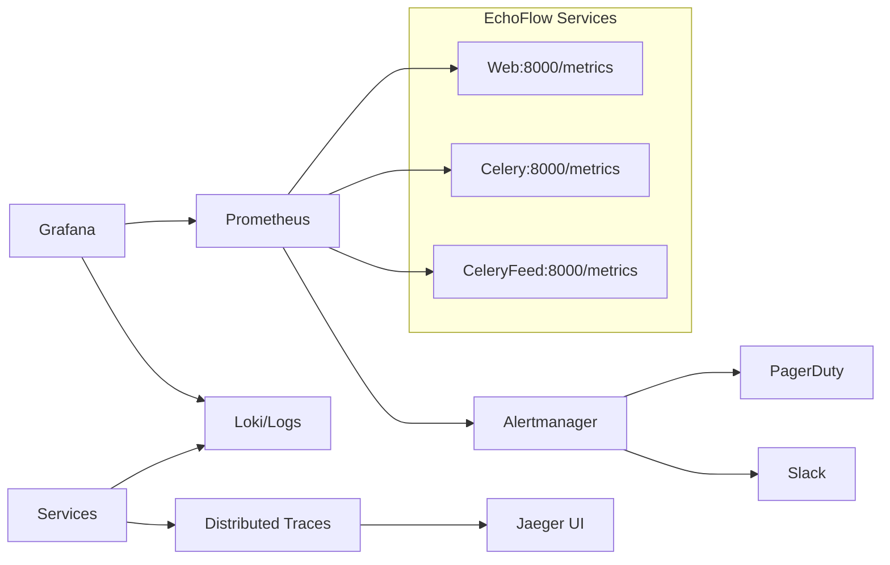

# Metrics & Health Endpoints

## Health Endpoints

### `/health/` — Liveness Probe
**File:** `backend/EchoFlow/health.py:9-17`

```python
def health_check(request):
    return JsonResponse({
        "status": "healthy",
        "timestamp": time.time(),
    })
```

**Purpose:** Process is alive
**Dependencies:** None
**Response Time:** < 1ms
**Used By:** Docker healthcheck, Kubernetes liveness probe, Load balancer

**Response:**
```json
{
  "status": "healthy",
  "timestamp": 1705312200.123
}
```

### `/ready/` — Readiness Probe
**File:** `backend/EchoFlow/health.py:19-40`

```python
def readiness_check(request):
    try:
        connection.ensure_connection()
        with connection.cursor() as cursor:
            cursor.execute("SELECT 1")
        return JsonResponse({
            "status": "ready",
            "database": "connected",
            "timestamp": time.time(),
        })
    except Exception:
        logger.exception("Readiness check failed during database connectivity validation.")
        return JsonResponse({
            "status": "not_ready",
            "database": "error",
            "timestamp": time.time(),
        }, status=503)
```

**Purpose:** App can serve traffic (DB connected)
**Dependencies:** PostgreSQL
**Response Time:** ~10-50ms (DB round-trip)
**Used By:** Docker healthcheck, Kubernetes readiness probe, Load balancer

**Success Response:**
```json
{
  "status": "ready",
  "database": "connected",
  "timestamp": 1705312200.123
}
```

**Failure Response (503):**
```json
{
  "status": "not_ready",
  "database": "error",
  "timestamp": 1705312200.123
}
```

---

## Prometheus Metrics (`/metrics/`)

### Configuration
**File:** `backend/EchoFlow/urls.py:13`
```python
from django_prometheus.exports import ExportToDjangoView
path('metrics/', ExportToDjangoView, name='prometheus_django_metrics')
```

**Package:** `django-prometheus==2.5.0` (installed via requirements-base.txt)

### Default Metrics Provided

#### HTTP Metrics
| Metric | Type | Description |
|--------|------|-------------|
| `http_requests_total` | Counter | Total HTTP requests by method, endpoint, status |
| `http_request_duration_seconds` | Histogram | Request latency by method, endpoint |
| `http_request_duration_seconds_bucket` | Histogram | Latency buckets |
| `http_response_size_bytes` | Histogram | Response size |

#### Database Metrics
| Metric | Type | Description |
|--------|------|-------------|
| `django_db_execute_total` | Counter | DB queries by type (SELECT, INSERT, etc.) |
| `django_db_execute_duration_seconds` | Histogram | Query latency |
| `django_db_connection_pool_size` | Gauge | Connection pool size |
| `django_db_connection_pool_usage` | Gauge | Active connections |

#### Cache Metrics
| Metric | Type | Description |
|--------|------|-------------|
| `django_cache_hits_total` | Counter | Cache hits |
| `django_cache_misses_total` | Counter | Cache misses |
| `django_cache_hit_ratio` | Gauge | Hit ratio |

#### Custom Metrics (None Defined)
```python
# To add custom metrics (not currently done):
from prometheus_client import Counter, Histogram, Gauge

FEED_LATENCY = Histogram('echoflow_feed_latency_seconds', 'Feed generation latency')
UPLOAD_SUCCESS = Counter('echoflow_uploads_total', 'Upload results', ['status'])
QUEUE_DEPTH = Gauge('echoflow_celery_queue_depth', 'Celery queue depth', ['queue'])
```

---

## Metric Collection

### Scraping Configuration (Prometheus)
```yaml
# prometheus.yml
scrape_configs:
  - job_name: 'echoflow'
    static_configs:
      - targets: ['web:8000', 'celery:8000', 'celery_feed:8000']
    metrics_path: '/metrics'
    scrape_interval: 30s
```

### Docker Healthchecks (Use Health Endpoints)

```yaml
# docker-compose.yml
healthcheck:
  test: ["CMD", "python", "-c", "import urllib.request; urllib.request.urlopen('http://localhost:8000/health/', timeout=4)"]
  interval: 30s
  timeout: 10s
  start_period: 90s
  retries: 3
```

**Web service:** HTTP `/health/`
**Celery workers:** Celery inspect ping (overrides image healthcheck)
**Celery beat:** Disabled (no HTTP server)

---

## Custom Metrics Needed

### Business Metrics (Not Implemented)
| Metric | Type | Purpose |
|--------|------|---------|
| `echoflow_feed_requests_total` | Counter | Feed requests by user, status |
| `echoflow_feed_latency_seconds` | Histogram | Feed generation time |
| `echoflow_upload_total` | Counter | Uploads by status (success/failed/processing) |
| `echoflow_processing_duration_seconds` | Histogram | AI pipeline duration |
| `echoflow_recommendation_quality` | Gauge | Click-through rate, completion rate |
| `echoflow_active_users` | Gauge | Currently active users |
| `echoflow_celery_queue_depth` | Gauge | Queue depth per queue |
| `echoflow_redis_memory_bytes` | Gauge | Redis memory usage |

### Implementation Pattern
```python
# backend/app/metrics.py (create)
from prometheus_client import Counter, Histogram, Gauge

FEED_REQUESTS = Counter(
    'echoflow_feed_requests_total',
    'Total feed requests',
    ['user_id', 'status']  # status: success, empty, error
)

FEED_LATENCY = Histogram(
    'echoflow_feed_latency_seconds',
    'Feed generation latency',
    buckets=[0.01, 0.05, 0.1, 0.25, 0.5, 1.0, 2.5, 5.0]
)

UPLOAD_STATUS = Counter(
    'echoflow_uploads_total',
    'Upload results',
    ['status']  # success, failed, validation_error
)

CELERY_QUEUE_DEPTH = Gauge(
    'echoflow_celery_queue_depth',
    'Celery queue depth',
    ['queue']  # celery, fast_feed, heavy_media
)

# Usage in views/tasks:
def list(self, request):
    start = time.time()
    try:
        # ... feed logic ...
        FEED_REQUESTS.labels(user_id=request.user.id, status='success').inc()
    except Exception:
        FEED_REQUESTS.labels(user_id=request.user.id, status='error').inc()
        raise
    finally:
        FEED_LATENCY.observe(time.time() - start)
```

---

## Monitoring Stack (Target)



### Alerting Rules (Examples)
```yaml
# prometheus/rules/echoflow.yml
groups:
  - name: echoflow
    rules:
      - alert: HighErrorRate
        expr: rate(http_requests_total{status=~"5.."}[5m]) > 0.05
        for: 2m
        labels:
          severity: critical
        annotations:
          summary: "High 5xx error rate"
      
      - alert: FeedLatencyHigh
        expr: histogram_quantile(0.95, echoflow_feed_latency_seconds_bucket) > 1
        for: 5m
        labels:
          severity: warning
        annotations:
          summary: "Feed generation P95 > 1s"
      
      - alert: CeleryQueueBacklog
        echoflow_celery_queue_depth > 1000
        for: 5m
        labels:
          severity: warning
        annotations:
          summary: "Celery queue {{ $labels.queue }} backlog"
      
      - alert: RedisMemoryHigh
        expr: redis_memory_used_bytes / redis_memory_max_bytes > 0.8
        for: 5m
        labels:
          severity: warning
        annotations:
          summary: "Redis memory > 80%"
```

---

## Log-Based Metrics (Alternative)

### Structured Logs → Metrics
```python
# Current: JSON logs to stdout
{"asctime": "2024-01-15T10:30:00", "name": "backend.app.tasks", "levelname": "INFO", "message": "Extracted acoustic vector"}

# Can be parsed by Loki/Grafana for:
# - Error rate by logger
# - Task duration percentiles
# - Queue processing rates
```

---

*Source: `backend/EchoFlow/health.py`, `backend/EchoFlow/urls.py`, `backend/EchoFlow/settings.py`, `docker-compose.yml`, `docs/backend-architecture-audit.md`*